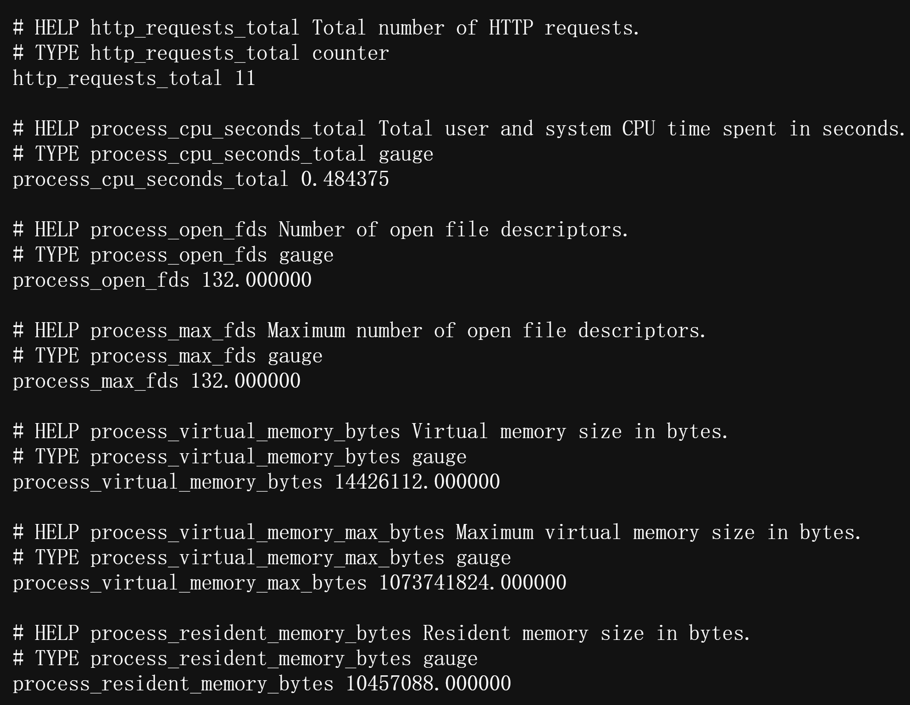

# mini-metrics

A small, lightweight Go metrics library that provides simple **concurrency-safe** Counters and Gauges in **Prometheus based-text format**, a minimal Registry, and an HTTP `/metrics` handler that emits exposition.

Besides the core metric types, it includes two default metric collectors:

- `HttpRequestsTotal` — a counter of total HTTP requests, along with a middleware to increment it on each request.
- `Process` - a set of gauges for process CPU and memory usage.

---

## Usage

```go
package main

import (
 "context"
 "errors"
 "log"
 "net/http"

 "github.com/MirRoR4s/metric/pkg/collector"
 "github.com/MirRoR4s/metric/pkg/metric"
)

func main() {
 ctx := context.Background()
 registry := metric.NewRegistry()
 counter, middleware, err := collector.NewHttpRequestsTotal()
 if err != nil {
  log.Fatalf("Error creating HTTP requests total counter: %v", err)
 }
 processCollector, err := collector.NewProcess(ctx) // Example: 1GB max virtual memory
 if err != nil {
  log.Fatalf("Error creating memory metrics: %v", err)
 }
 registry.Register(counter, processCollector)
 mux := http.NewServeMux()
 mux.Handle("/metrics", registry.Handler())
 mux.HandleFunc("/hello", func(w http.ResponseWriter, r *http.Request) {
  w.Header().Set("Content-Type", "text/plain")
  w.Write([]byte("Hello, World!"))
 })
 srv := &http.Server{
  Addr:    ":8080",
  Handler: middleware(mux),
 }
 if err := srv.ListenAndServe(); err != nil {
  if errors.Is(err, http.ErrServerClosed) {
   log.Println("Server closed")
  } else {
   log.Fatalf("Server error: %v", err)
  }
 }
}

```

Run it and query the endpoints:

```bash
go run examples/main.go
curl http://localhost:8080/hello
curl http://localhost:8080/metrics
```



## License

Code is distributed under Apache License 2.0, feel free to use it in your proprietary projects as well.
